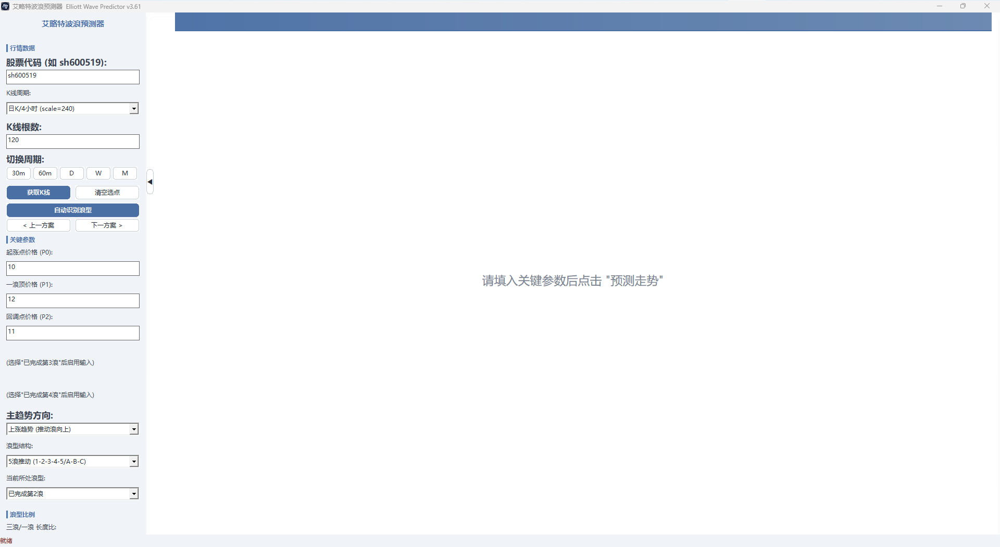
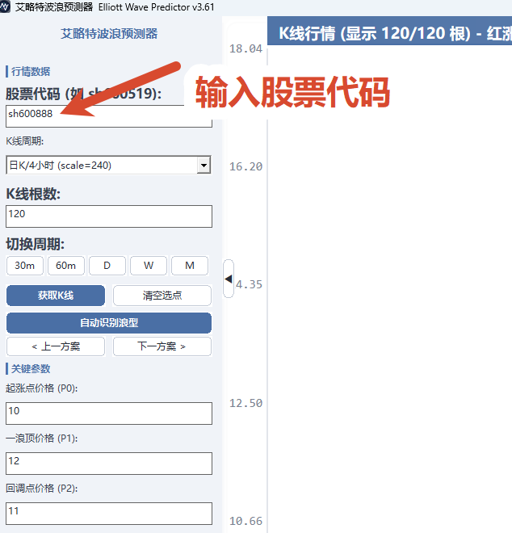
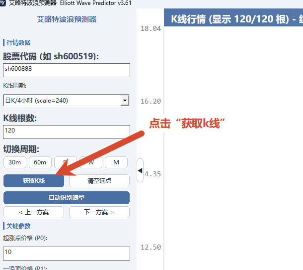
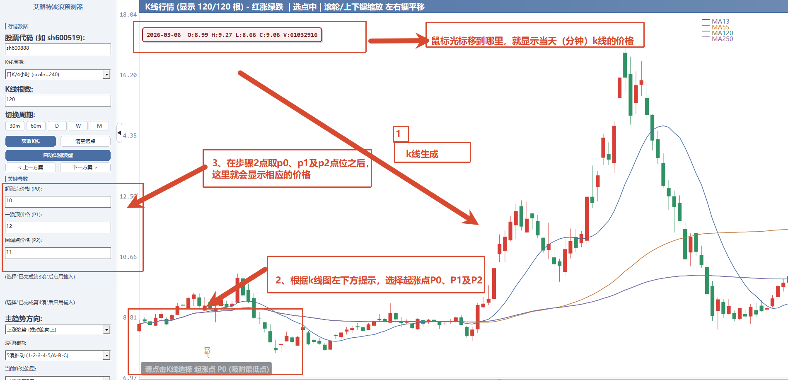
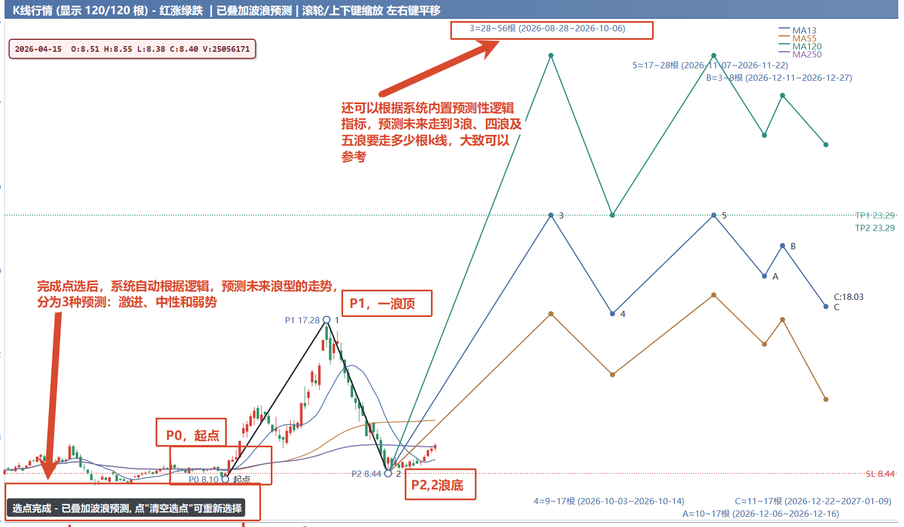
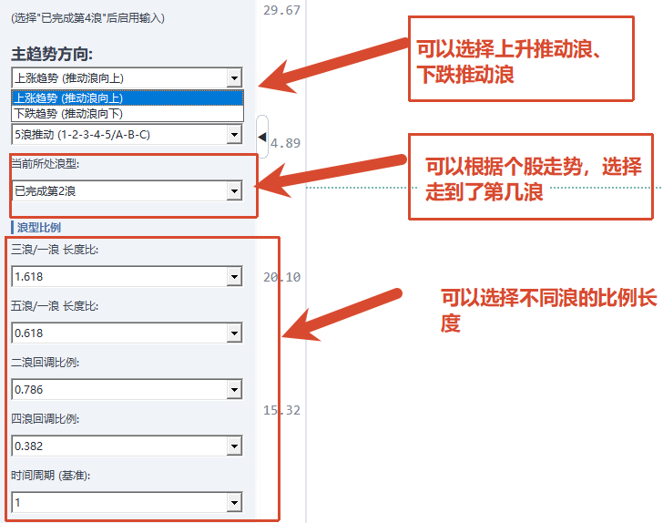
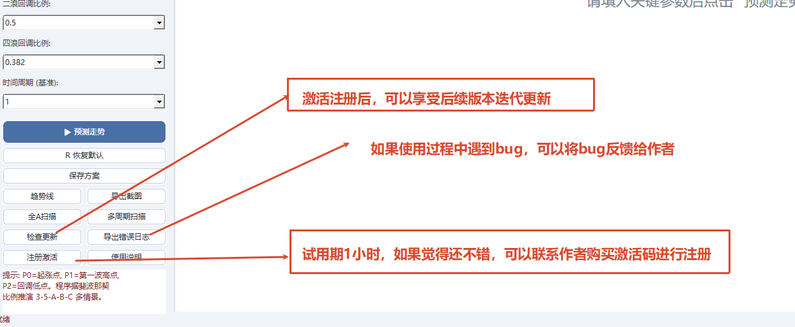

[English](README.en.md) | [简体中文](README.md)

# Elliott Wave Predictor · 艾略特波浪预测器

**Intelligent wave recognition and multi-scenario projection based on Elliott Wave Theory**

Windows desktop · No installation · Single portable file · Auto online updates

[Features](#-features) · [Usage Guide](#-usage-guide-with-annotated-screenshots) · [Quick Start](#-quick-start) · [Registration](#-registration) · [Changelog](#-changelog) · [Disclaimer](#-disclaimer)

---

## ✨ Features

### 📈 Smart Wave Recognition Engine
- **One-click auto recognition**: Validated by a self-developed logic engine, automatically identifies **waves 1-5 + ABC corrections**
- **Multi-scenario projection**: Multiple candidate scenarios for the same market move, each with a **confidence score**
- **Manual point selection**: Click P0~P4 key points on the candlestick chart to project 3-5-A-B-C scenarios
- **Time projection (v2.95+)**: Estimates duration windows for future waves 3/4/5/C, marked by vertical dashed lines at the top of the chart (≈X~Y candles)

### 🕯️ Professional Chart Interaction
- Crosshair with real-time **OHLCV** data, volume shown alongside
- Wheel zoom / drag pan
- **Auto stop-loss & take-profit**: red dashed line = stop-loss (wave-2 trough), green dashed line = take-profit (wave-3/wave-5 peak)
- **Trendline tool**: multi-anchor rays, 4 colors cycling, multiple lines can be overlaid

### 🔍 Multi-Timeframe & Batch Scanning
- **Multi-timeframe scan (recommended)**: auto-checks 30m / 60m / Daily / Weekly / Monthly, scores each timeframe, popup lists the best one for one-click load
- **Scan All A-Shares**: batch-scans wave patterns on daily candlesticks for all A-share stocks (~5,200), dual-thread concurrent with rate limiting

### 🛠️ Utility
- **One-click screenshot**: export BMP chart / `Ctrl+C` copy to clipboard
- **Session save**: `Ctrl+S` saves current candlesticks + picks + params, restore and continue anytime
- **Auto update**: silent check on startup, prompts when a new version is found, auto-restarts after download; a failed update never affects the current version
- **Multi-mirror fallback**: GitHub raw + CDN dual channels, best-version selection + sha256 integrity check

### ⚡ Performance & Experience
- Direct2D hardware-accelerated rendering, incremental drawing + cache pools, smooth scrolling with 10k+ candlesticks
- Lightweight native Win32 app, single portable file, low memory footprint
- Complete in-app usage guide (5-tab built-in help)

---

## 📖 Usage Guide (with annotated screenshots)

The 7 screenshots below walk through the real workflow, from the main window to a complete wave projection.

### 1. Main Window Overview
The left panel holds parameters (symbol, timeframe, candle count, key params, trend direction, etc.); the right side is the candlestick chart area. The info bar on top shows OHLCV data of the hovered candle.

### 2. Enter a Symbol
Type a code in the "Symbol" field (Shanghai: `sh` prefix, e.g. `sh600519`; Shenzhen: `sz` prefix, e.g. `sz000001`), press Enter.

### 3. Click "Fetch Candlesticks" to Load History
Click the button and the program pulls historical candlestick data for the symbol/commodity; the chart on the right displays automatically once loaded.

### 4. Hover + Manual Point Selection
- **Hover**: move over any candle, the top info bar shows that day's (minute's) open/high/low/close/volume in real time
- **Manual selection**: following the hint at the chart's bottom-left, click **Origin P0** (swing low), **Wave-1 Peak P1** (swing high), **Pullback P2** in order — the prices appear in the left panel automatically

### 5. Auto Wave Recognition + Multi-Scenario Projection
After picking points, click "Auto-Detect Waves" and the engine projects **how many candlesticks waves 3, 4 and 5 will take**, overlaid as **Aggressive / Neutral / Weak** scenarios. Use "`< Prev Scenario` / `Next Scenario >`" to cycle between candidates.

### 6. Adjust Trend Direction & Wave Ratios
- "Trend Direction": **impulse wave up / impulse wave down**, plus 5-wave structures (1-2-3-4-5 or A-B-C)
- "Wave Ratios": fine-tune wave3/wave1, wave5/wave1, wave2/wave3, wave4/wave3 ratios (golden ratios 0.618 / 0.382 / 0.786, etc.)

### 7. Bottom Action Buttons
- `▶ Predict` (core button, click once params are ready)
- `R Reset` / `Save Scenario` / `Trendline` / `Export Screenshot`
- `Scan All A-Shares` / `Multi-Timeframe Scan` / `Check for Updates` / `Export Error Log`
- `Register` / `Usage Guide`

The trial version gives you **1 hour** of trial time — buy a license key from the author once you find it worthwhile.

---

## 🚀 Quick Start

1. **Download**: get the latest `ElliottWavePredictor_v3.83.exe` from [Releases](https://github.com/skykuler/Elliott-Wave-Predictor/releases)
2. **Run**: double-click to run, no installation needed (a dedicated folder like `D:\EWP\` is recommended)
3. **Fetch candlesticks**: enter a symbol → pick a timeframe → click "Fetch Candlesticks"
4. **Analyze**:
   - Method 1: click "Auto-Detect Waves" → click a start point on the chart → system auto-recognizes and offers multiple scenarios
   - Method 2: manually click P0~P4 key points → a wave projection is generated automatically
5. **Confirm across timeframes**: click "Multi-Timeframe Scan" and load the best-scoring timeframe from the popup

---

## 🔑 Registration

- Unregistered versions have a **trial time limit**
- Click "Register" and enter a license key to unlock permanently
- **Purchase online**: click "Buy Online" to open the Alipay QR window, pay **¥29.90**, then send your **machine code** to the developer to receive a license key
- The key is bound to the machine code — export your machine code before changing computers or reinstalling the OS

---

## 📦 Changelog

### v3.83 (2026-08-09)
- Input box numbers vertically centered (Symbol / Candle Count / Origin / Wave-1 Peak / Pullback, etc.)

### v3.82 (2026-08-09)
- Multi-timeframe result dialog fully localized (complete zh/en toggle coverage)

### v3.81 (2026-08-09)
- Full code review: removed dead code + fixed translation gaps, performance & stability confirmed

### v3.80 (2026-08-09)
- Panel buttons re-ordered per your spec (Trendline | Export Screenshot / Scan All | Multi-TF Scan / Language | Theme / Export Log | Guide / Check Updates | Register)

### v3.79 (2026-08-09)
- Chart scrollbar themed to match the ComboBox arrow style

### v3.78 (2026-08-09)
- Fixed Windows title bar staying dark in light theme

### v3.77 (2026-08-09)
- Added "Toggle Theme" button: light slate-blue-gray by default, one click to dark (deep slate blue + bordeaux)

### v3.76 (2026-08-09)
- English localization polish: K-line → Candlestick, Period → Timeframe, Retracement, etc., aligned with industry standard terms

### v3.75 (2026-08-09)
- Input field sunken look enhanced + ComboBox arrow fully self-drawn (theme-consistent)

### v3.74 (2026-08-09)
- Chart title gradient switched to dark bordeaux + immersive dropdown arrow / input field fixes

### v3.73 (2026-08-09)
- Backfilled hardcoded colors missed in v3.72; chart truly re-skinned + system controls follow dark theme

### v3.72 (2026-08-09)
- UI skin polish: deep slate-blue background + bordeaux accent (no feature/layout/interaction changes)

### v3.71 (2026-08-09)
- Fixed point-selection hints staying Chinese in English mode (zh/en toggle fully fixed)

### v3.67 ~ v3.70 (2026-08-09)
- One-click zh/en toggle: panel / status bar / chart text fully English, idiomatic terms

### v3.62 ~ v3.66 (2026-08-08)
- Payment window & wave projection fixes: failed-wave pattern, wave-3/wave-5 peaks, drag misoperation, etc.

### v3.48 ~ v3.61 (2026-08-08)
- Auto-update system built: multi-mirror fallback, update mechanism fixes, status bar freeze fixes

> Full history: see the [Releases](https://github.com/skykuler/Elliott-Wave-Predictor/releases) page

---

## 📝 Disclaimer

**Important**: This software performs technical analysis based on Elliott Wave Theory. All recognition results, scores and projections are **for reference only and do not constitute investment advice**. Financial markets carry risk; past patterns do not guarantee future moves. Please make your own judgments and trade at your own risk.

---

## 📬 Contact & Feedback

- Encountered an issue? Click "Export Error Log" in the app and send the `ewp_error.log` to the developer for fast diagnosis
- Licensing / business cooperation: use the in-app "Buy Online" entry or open an issue on this repo

---

**If this tool helps you, a ⭐ Star is appreciated!**

